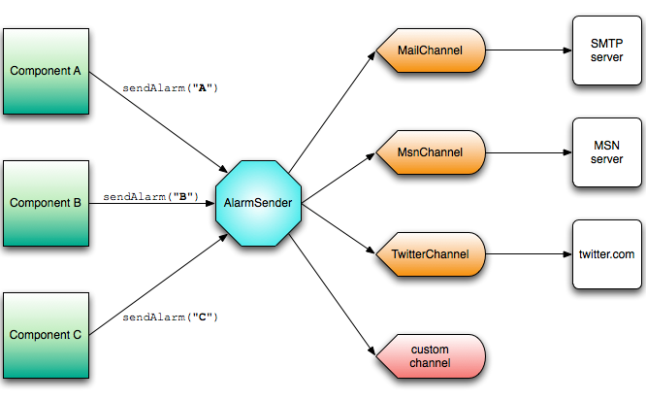

Goal
====
The goal of this project is to provide Java application developers with a tool to easily implement an alarm mechanism on server applications. 
Server applications usually have to be monitored constantly to check for any problems, but sometimes a condition arises (like some exception 
that you know only happens as the result of something very bad) that someone should know about ASAP. So instead of having to write and test 
a bunch of code to send an email notification or a SMS to the sysadmin, you can just use this library.

How it works
============
This diagram shows how jAlarms works; it's very simple. Your components invoke the sendAlarm() method on the AlarmSender component, which 
in turn sends the corresponding alarm messages through its available channels. You can create your own custom channels or just use the ones 
included with the library, configuring them the way it best fits your application.

